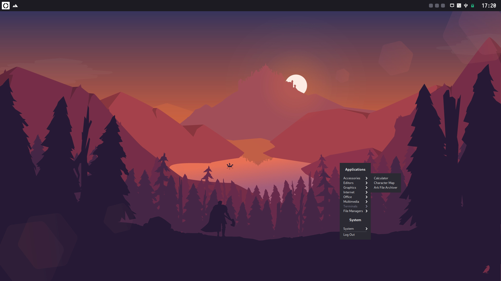
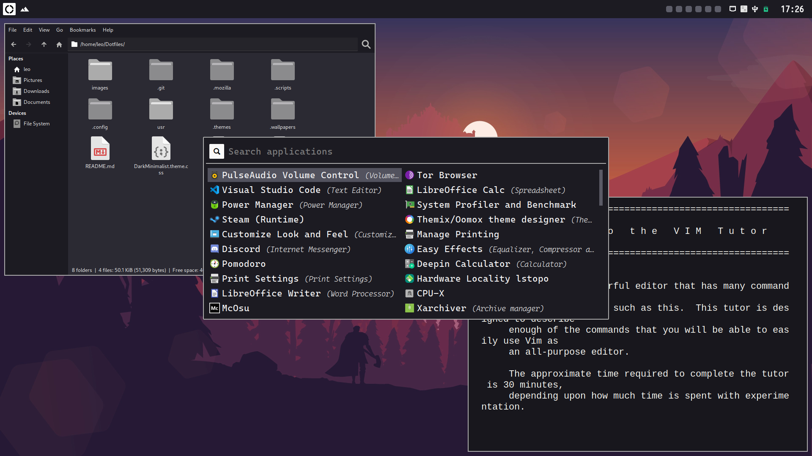

# LeonN's dotfiles

These are my configuration files for making a base Arch Linux installation a usable system for day-to-day work. For programs that allow color customizations, I synchronized its conlfig files to look alike by working under the same color palette. The GTK theme that applies to most of the programs is called **Dark Minimalist**, a dark theme that looks good, but it's simple enough to appear elegant. These config files have only been tested on Arch Linux. If you use another OS, some files might not work well or not work at all. 

## Disclaimer

Most of these files are modifications of [owl4ce's dotfiles](https://github.com/owl4ce/dotfiles). I did not create many files you'll see and there will be modified files from other sources that may or may not be referenced to the original author.